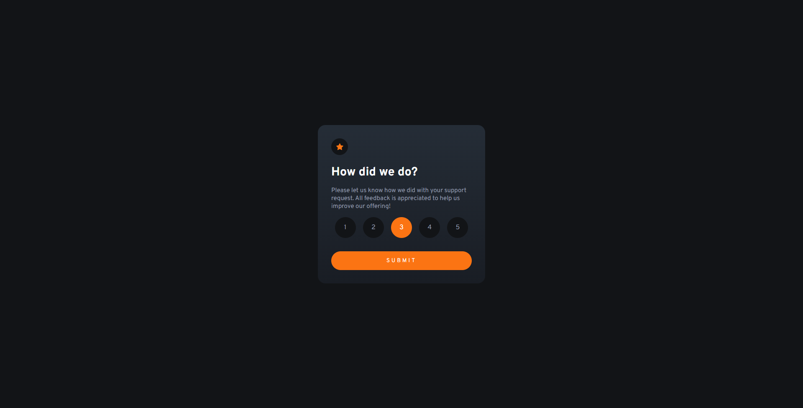
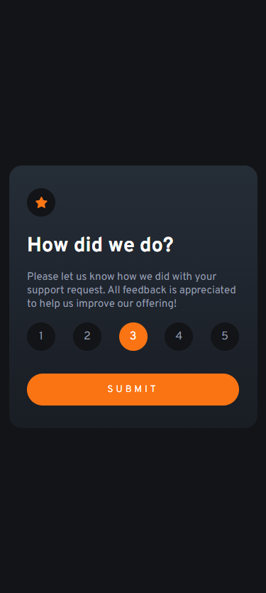

# Frontend Mentor - Interactive rating component solution

This is a solution to the [Interactive rating component challenge on Frontend Mentor](https://www.frontendmentor.io/challenges/interactive-rating-component-koxpeBUmI). Frontend Mentor challenges help you improve your coding skills by building realistic projects. 

## Table of contents

- [Overview](#overview)
  - [The challenge](#the-challenge)
  - [Screenshot](#screenshot)
  - [Links](#links)
- [My process](#my-process)
  - [Built with](#built-with)
  - [What I learned](#what-i-learned)
- [Author](#author)

## Overview

### The challenge

Users should be able to:

- View the optimal layout depending on their device's screen size
- See hover and focus states for interactive elements

### Screenshot

### Links

- Solution URL: [Site-Fm](https://www.frontendmentor.io/challenges/fylo-data-storage-component-1dZPRbV5n/hub/responsive-fylo-data-storage-with-absolute-propertys-cIkaW5lXSc)
- Live Site URL: [Site-Url](https://fylodatastoragecompfm.netlify.app/)

## My process

### Built with

- HTML5
- CSS custom properties
- Mobile-first workflow
- Flexbox
- Js

### What I learned

I learned a bit more of mobile first design and the flex property. Js is hard for me, but i improve that.

## Author

- Frontend Mentor - [@Alenayc-Git](https://www.frontendmentor.io/profile/Alenayc-Git)
